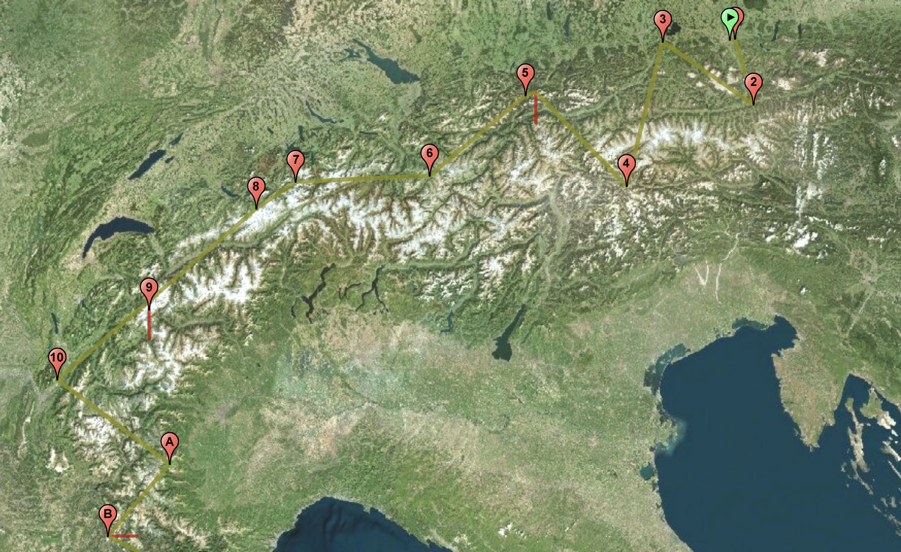

# Leaflet KML layer plugin



Demo: https://www.windy.com/uploader

This plugin was extracted from Pavel Shramov's Leaflet Plugins [repository](https://github.com/shramov/leaflet-plugins) in order to maintain this code more frequently and separate KML layer from other plugins.

So far we have fixed few issues.

Probably will work on Leaflet 1+, tested on Leaflet 1.4.

## How to use

```html
<html>
    <head>
        <link rel="stylesheet" href="http://unpkg.com/leaflet@1.4.0/dist/leaflet.css" />
        <script src="http://unpkg.com/leaflet@1.4.0/dist/leaflet.js"></script>
        <script src="./L.KML.js"></script>
    </head>
    <body>
        <div style="width: 100vw; height: 100vh" id="map"></div>
        <script type="text/javascript">
            // Make basemap
            const map = new L.Map('map', { center: new L.LatLng(58.4, 43.0), zoom: 11 });
            const osm = new L.TileLayer('http://{s}.tile.openstreetmap.org/{z}/{x}/{y}.png');

            map.addLayer(osm);

            // Load kml file
            fetch('assets/example1.kml')
                .then(res => res.text())
                .then(kmltext => {
                    // Create new kml overlay
                    const parser = new DOMParser();
                    const kml = parser.parseFromString(kmltext, 'text/xml');
                    const track = new L.KML(kml);
                    map.addLayer(track);

                    // Adjust map to show the kml
                    const bounds = track.getBounds();
                    map.fitBounds(bounds);
                });
        </script>
    </body>
</html>

```

## Licence

MIT
